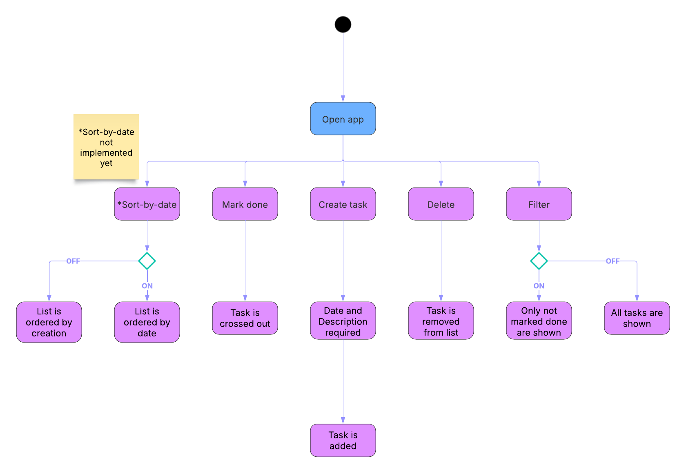

## Introduction
Remington Bassett  
2/7/2025  
Lab 2A & 2B

## Executive Summary
In this lab, I implemented the JavaScript functions necessary to make the To-do website functional. All of the features of the app -- such as the delete icon, create task button, and toggles -- now work as a user might expect. In this lab I also enabled HTTPS. 

## Design Overview & UML


*UML of to-do app functions*

The first thing a user can do when opening the app is create a task. They must enter both a description and a date in order for it to work. Once they do, it will create a task. This is done by adding a line of html into the div with class="task-container." This is what the html looks like.


```
<li class="task">
            <input type="checkbox" class="task-done checkbox-icon" id="task-${this.id}" ${this.done ? 'checked' : ''} 
                        onclick="updateTask(${this.id})">
            <span class="task-description">${this.text}</span>            
            <span class="task-date">${this.prettyDate()}</span>
            <button class="task-delete material-icon" onclick="deleteTask(${this.id})">delete</button>
</li>
```

*A freshly created task*


The delete button deletes this html. If a user marks a task as done, it crosses a line through the task with simple css. If the 'Filter' toggle is toggled on, it will only display unchecked tasks. This is done with a simple `filterTasks()` function that saves the tasks, deletes all elements in the task container, then adding them back in if `task.done` is false. 


*A task being marked off*


*A task being filtered out*


### File modifications
- js/script.js - added CRUD functionality

## Questions
What is the difference between http and https?  
- Both are the standard protocol for sending information over the internet, but HTTPS is the secure way to do so. It encrypts the data being sent.

What does the A record do in your DNS domain?
- The A record maps my domain name to my specific IP address. Now I can type in the domain name instead of the IP address
  
Which key does the certbot tool send to Let's Encrypt to be embedded in the certificate; the public key or the private key?
- public key
  
What is the TTL setting in DNS, what are the units, and what does it do?
- The TTL is the time, in seconds, that it takes before records refresh
  
The DNS registrar tool is new this year. What did you like about it? What could we do to improve it? (Any answer gets full credit.)
- It was very simple! I didn't have much trouble, but I wish errors were more descriptive. 
  
How would you incorporate bash scripts in your future?
- Anything that requires using a string of commands I might use a bash script for. Setting up node and Tailwind in my projects for example.
  
What are two differences and similarities between JavaScript and a previous language you have used (e.g. C++ or Python)? (Think of differences and similarities that are more unique to these 2 languages, not all languages in general.)
- The syntax is quite different - JS uses curly braces and semi-colons to seperate code, whereas Python uses indentation
- Python uses self while JS uses this (if I'm understanding them correctly, they serve a similar purpose).
- Both are interpreted languages (compared to compiled)
- They both use OOP principles
  
What is the difference between JSON and JavaScript objects?
- JSON uses a string format and used to transfer data, whereas JS objects are structures in memory used to store data
  
If you open your web page in two different browsers, will changes on one appear on the other? Why or why not?
- No, I'm opening it up locally so there isn't anything to sync them 
  
How long did you spend on this lab?
- About 4 hours

## Lessons Learned
### CNAME connection
After making a CNAME record, the server wasn't connecting to the new URL. This happens when apache config files are not properly updated. Using sudo commands, change the config files to support the new CNAME record sub domain change. 
### CNAME creation
A CNAME record cannot be created for many reasons. If there is no A record attached to the domain, a CNAME record cannot be created. Also, if the CNAME record does not follow this format - subdomain.orignialdomain.net/com/etc - it will not work. The solution is to make sure an A record is attached to the domain, and that the CNAME record follows the previous format. 
### CRUD functions 
If the proper functions are not used, it can be difficult to retrieve previously deleted HTML (ex. a filter toggle turning off). This happens when the HTML is not stored properly. In order to fix this, store the HTML in local storage, then delete it. It can be retrieved later that way.

## Skills Aquired
- Configure HTTPS
- Create DNS records
- Implement CRUD functions

## Resources
https://www.lucidchart.com/pages/uml-activity-diagram  
https://www.w3schools.com/whatis/whatis_json.asp  
https://byjus.com/gate/difference-between-compiled-and-interpreted-language/#:~:text=A%20compiled%20language%20is%20converted,a%20program%20into%20machine%20language.&text=The%20compiled%20programs%20run%20faster%20than%20interpreted%20programs.
https://support.dnsimple.com/articles/cname-record/
